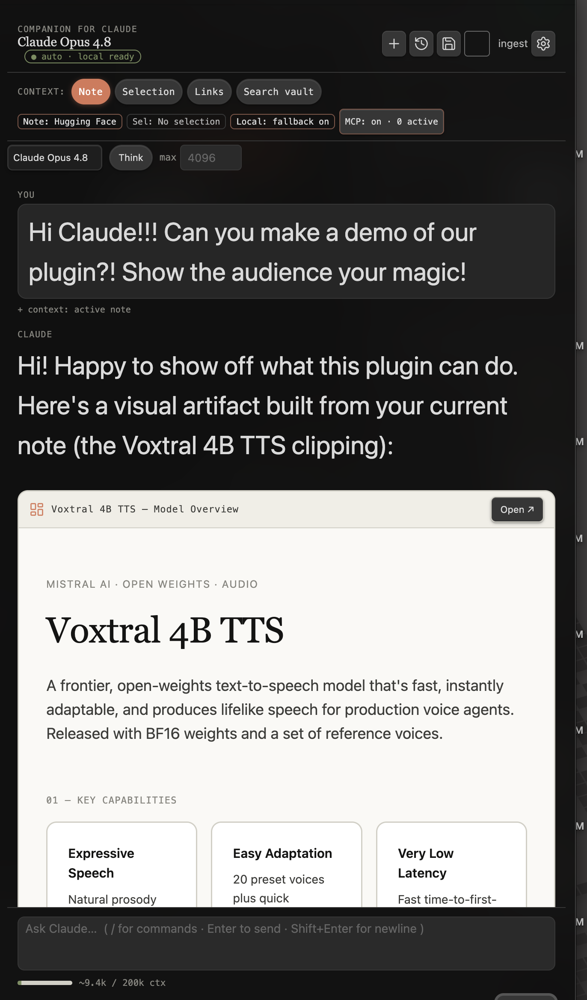
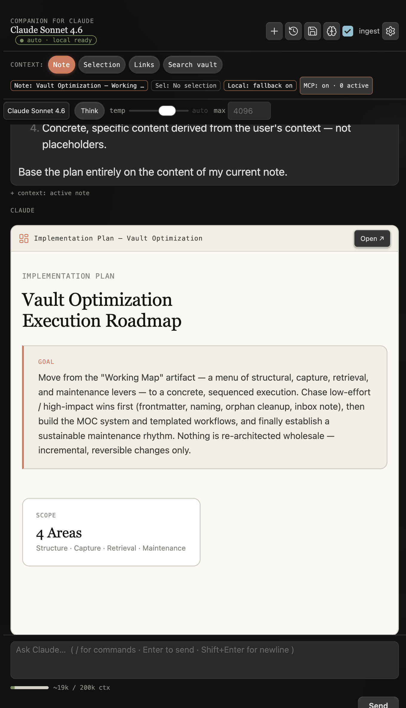
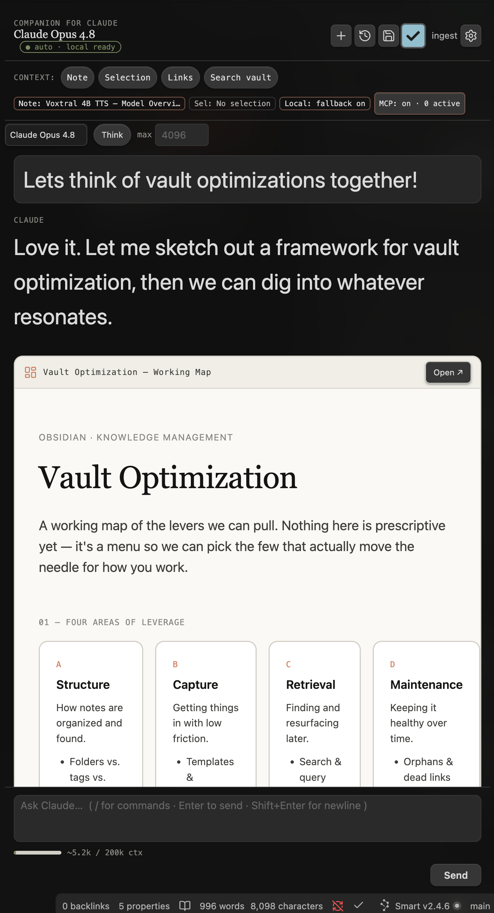

# Companion for Claude (Obsidian plugin)

Chat with Claude inside your [Obsidian](https://obsidian.md) vault — notes as
context, interactive `claude-html` artifacts, agent mode with reviewable
writes, and a local MCP bridge so Claude Code works on the same notes. Your
vault stays the single source of truth.

[](https://github.com/cavi-ai/claude-obsidian/actions/workflows/obsidian-plugin-ci.yml)
[](https://obsidian.md/plugins?id=claude-companion)
[](LICENSE)



<!-- screenshots wanted: session-to-note.png, chat-controls.png — see assets/CAPTURE.md in the mirror repo -->

> **Bring your own credential.** Companion for Claude talks to the Anthropic
> Messages API with *your* credential — nothing is sent anywhere else. On desktop,
> direct network access is required for Claude and the local MCP bridge; on mobile,
> chat, artifacts, and semantic search all work, with only the MCP bridge and
> session import gated off (desktop/Electron only). Three auth modes:
>
> - **API key** (default, recommended) — a standard `sk-ant-api…` key from
>   console.anthropic.com. This is the mode used for community-store builds.
> - **Long-term OAuth token** (power users) — paste a token from
>   `claude setup-token` (`sk-ant-oat…`) to authenticate as your Claude
>   subscription; usage draws on your plan rather than pay-as-you-go API credit.
> - **Import from environment** — read `ANTHROPIC_API_KEY` /
>   `ANTHROPIC_AUTH_TOKEN` (+ `ANTHROPIC_BASE_URL`) from the environment, the way
>   the CLI does.
>
> An optional **base URL** override points any mode at a gateway/proxy. The key
> stays the default so the plugin remains community-store eligible; the token and
> environment modes are clearly marked as power-user options.

## Features

### Chat & context

- **Chat in a side panel** — streaming responses, Markdown-rendered, with
  per-message **Copy / Insert / Save as note / Regenerate** actions and
  hover-to-copy on every code block.
- **Vault-aware context** — `@`-mention notes, folders, or the whole vault;
  toggle context pills for your **active note**, the **current selection**,
  **linked & backlinked notes**, or a **vault search**. Keyword search by
  default; optional **semantic search** fuses with keywords when enabled, using
  a built-in on-device model (default; one-time ~45MB model + ~23MB ONNX
  runtime download from huggingface.co / cdn.jsdelivr.net, cached and fully
  offline afterwards) or a local Ollama server.
- **PDFs & images in chat** — @-mention any PDF or image in your vault, or
  **paste a screenshot** straight into the composer; Claude reads it natively
  (vision + document understanding). Attachments are per-message pills you can
  remove before sending.
- **In-chat model & reasoning controls** — switch model per message
  (**Opus / Sonnet / Haiku**), toggle **extended thinking** with an **effort**
  dial, stream the model's **reasoning** in a collapsible panel, and set
  per-message **temperature / max tokens**. Controls are model-aware — anything
  a model would reject is hidden, not broken.
- **Slash commands** — type `/` in the composer for a fuzzy palette:
  summarize, ask, improve, artifact, plan, canvas, workflows, capture, build,
  and more.
- **Conversation history** — chats persist across restarts; resume any past
  conversation from a fuzzy picker.
- **Prompt caching** — repeated context (system prompt, tools, conversation
  history) is cached server-side automatically, cutting input cost by up to
  ~10× on long conversations. The cost estimate in the usage bar accounts for
  cache reads and writes.
- **Live usage display** — a context-window gauge plus running **session token
  totals** (and an estimated cost on API-key auth, or a subscription marker on
  OAuth), so there are no billing surprises.
- **Save & test connection** — one click confirms settings are saved and the
  credential works, with readable, actionable errors.
- **Commands** — *Open chat panel*, *New chat*, *Resume a past conversation*,
  *Generate implementation plan from current note*, *Turn selection / note into
  an artifact*, *Ask Claude about my vault*, *Hand off current note to Claude
  Code (build)*.

### Artifacts & generation

The artifact design system takes its aesthetic cues from Thariq Shihipar's
[“unreasonable effectiveness of HTML”](https://github.com/ThariqS/html-effectiveness)
gallery (vendored as a pinned submodule at the monorepo root) — an original
reformulation, not a copy — so the plans, reports, and dashboards Claude
generates look gallery-grade. See the
[`NOTICE`](https://github.com/cavi-ai/claude-obsidian/blob/main/NOTICE) for full
attribution.

- **Interactive artifacts** — Claude emits a `claude-html` block;
  Companion renders it inline in a sandboxed iframe, **opens it in your browser**,
  or **saves it as a note** that stays interactive and portable.
- **Canvas mind maps** — `/canvas` (or just ask): Claude searches your vault
  and builds a native **Obsidian Canvas** — file nodes wired to your real
  notes, labeled edges, auto-layout. A write like any other: gated and
  confirmed before the .canvas file is created. Also available to Claude Code
  over the MCP bridge.
- **Bases from your frontmatter** — ask for "a reading tracker" or "a project
  dashboard" and Claude builds a native **Obsidian Base** (.base database
  view), discovering your real frontmatter properties first. Write-gated and
  confirmed, in chat and over the MCP bridge.
- **Indexing & tags** — saved artifacts and chats get YAML frontmatter
  (`title`, `tags`, `summary`, `type`) so they index in the tag pane, search,
  and Dataview, with optional local-model **auto-tagging**.
- **Spec → build handoff** — turn a plan note into a **build spec** + a live
  **tracker** (a `claude-html` progress board) and hand it to **Claude Code**.


*A `claude-html` artifact rendered inline — interactive, sandboxed, and saved as a plain Markdown note.*

### Agent & automation

- **Agent mode (vault tools in chat)** — Claude can **search your vault, read
  notes, and follow links on its own** while answering, showing each step as an
  expandable tool chip. Read-only by default; an optional setting also lets it
  **create and edit notes**, with a confirmation dialog before every write
  ("Allow", "Allow for this session", or "Deny"). Turn it all off in settings
  for plain chat with pre-attached context.
- **Apply edits as reviewable diffs** — ask Claude to improve or fix a note and
  it **proposes the change as a red/green diff**; you accept or reject **each
  hunk** before anything is written, and Claude is told exactly what you
  accepted. Works even with write tools off — the review is the permission.
- **Link suggestions while you write** — the Related panel surfaces **unlinked
  mentions** (note titles and aliases sitting in your prose as plain text) with
  one-click linking, or **Review & link all** as a single diff. No embeddings
  needed; works alongside the semantic related-notes list.
- **Consolidated memory** — merge captured session digests into one evolving
  **"What Claude Knows"** note (manual command or auto after each capture).
  It's a normal note — agent mode reads it back with its own tools, so Claude
  remembers your projects, decisions, and preferences across chats.
- **Never lose functionality (offline)** — an **Auto** backend transparently
  falls back to a local **Ollama** model when Claude is offline or out of usage,
  with a live connectivity indicator; or run **Local only** for full offline use.
  Cheap utility work (summaries, auto-tagging) can route to Ollama too.
- **Unified bridge** — expose the vault as a local MCP server so Claude Code
  and Claude Desktop operate on the same notes ([details below](#unified-bridge-mcp-server)).

|  |  |
|---|---|
| *A prioritized roadmap artifact, produced by an advisor persona surveying the vault over the bridge.* | *A generated working map — a canvas-style overview built from real notes.* |

### Experimental (off by default)

- **Typed source capture** — watch a clippings
  inbox (default `Clippings/`) and enrich new clips with typed frontmatter
  (article, video, dataset) from per-type schemas.
- **Vault ontology** — schema notes in an
  `Ontology/` folder define **note types and typed wikilink relations**; run
  **Seed ontology** to create the defaults, and notes Claude creates conform to
  your schemas (advisory, never blocking). Enable under *Vault ontology* in
  settings.

## Install

**From the community store (recommended):** *Settings → Community plugins →
Browse* → search **Companion for Claude** → Install → Enable, or use
[this direct link](https://obsidian.md/plugins?id=claude-companion). Then open
*Settings → Companion for Claude* and paste your Anthropic API key.

**From source (development):**

1. `cd obsidian-plugin && pnpm install && pnpm run build`
2. Copy `main.js`, `manifest.json`, and `styles.css` into
   `<your-vault>/.obsidian/plugins/claude-companion/`.
3. Enable **Companion for Claude** in *Settings → Community plugins*.

For active development use `pnpm run dev` (esbuild watch) and symlink the plugin
folder into a test vault.

## Unified bridge (MCP server)

Companion can expose your vault as a local **MCP server**, so **Claude Code** and
**Claude Desktop** work against the *same* knowledge base you chat with here —
the compliant way to unify all three without subscription OAuth.

Enable it in *Settings → Companion for Claude → Unified bridge (MCP server)*.
The server binds to **127.0.0.1 only** (never the network), requires a
**bearer token**, and shows ready-to-paste connection snippets for both clients.

| Read tools (always exposed) | Write tools (require *Allow writes*) |
|---|---|
| `vault_search` | `note_create` |
| `note_read` | `note_append` |
| `list_recent` | `note_update` |
| `vault_tags` | `update_frontmatter` |
| `list_titles` | `note_move` |
| `get_backlinks` | `base_create` |
| `get_outgoing_links` | `canvas_create` |
| `frontmatter_query` | |

With *Vault ontology* enabled, `note_create` also accepts `type` / `properties`
for schema-conformant typed notes.

**Claude Code:**

```bash
claude mcp add --transport http obsidian-vault \
  http://127.0.0.1:22360/mcp --header "Authorization: Bearer <token>"
```

**Claude Desktop** (`claude_desktop_config.json`, via `mcp-remote`):

```json
{
  "mcpServers": {
    "obsidian-vault": {
      "command": "npx",
      "args": ["-y", "mcp-remote", "http://127.0.0.1:22360/mcp",
               "--header", "Authorization: Bearer <token>"]
    }
  }
}
```

Now ask Claude Code "search my vault for X" or "create a note summarizing this"
and it operates directly on your Obsidian notes.

## How artifacts work

When Claude returns a fenced ```` ```claude-html ```` block, Companion renders
the document inside a **sandboxed** iframe (`allow-scripts` but **not**
`allow-same-origin`) — interactions and scripts run, but the artifact can't
touch your vault or cookies. A restrictive iframe CSP also blocks network calls
and form submissions. Set a height per-block with ` ```claude-html height=720 `.

Saving an artifact writes a Markdown note containing that same block, so the
artifact lives in your vault, renders in Reading view, and travels with your
notes.

### The `claude-html` block

You can author these by hand too:

````markdown
```claude-html height=600
<!DOCTYPE html>
<html><head><meta charset="utf-8"><title>Hello</title></head>
<body style="font-family:ui-serif;background:#FAF9F5;padding:40px">
  <h1 style="color:#141413">It renders inline.</h1>
</body></html>
```
````

## Development & testing

The Obsidian-free logic (SSE parsing, artifact extraction, search scoring) is
factored into pure modules so it can be unit-tested without a running app.

```bash
pnpm run typecheck   # tsc --noEmit
pnpm run lint        # eslint
pnpm test            # vitest (unit tests in test/)
pnpm run build       # typecheck + production bundle
```

CI runs all four on every push/PR (Node 20 & 22) in the
[monorepo](https://github.com/cavi-ai/claude-obsidian). A manual smoke-test
checklist lives in [`CONTRIBUTING.md`](https://github.com/cavi-ai/claude-obsidian/blob/main/CONTRIBUTING.md).

## Releases

| | |
|---|---|
| Store listing | [Companion for Claude](https://obsidian.md/plugins?id=claude-companion) (`claude-companion`) |
| Source of truth | [`cavi-ai/claude-obsidian`](https://github.com/cavi-ai/claude-obsidian) monorepo, `obsidian-plugin/` |
| Release repo | [`cavi-ai/companion-for-claude`](https://github.com/cavi-ai/companion-for-claude) — built `main.js`, `manifest.json`, `styles.css` attached per release |
| Versioning | `manifest.json` = `versions.json` = `package.json` = git tag (exact version, no `v` prefix) |

Releases are cut by the monorepo's release workflow, which runs the full gate
(typecheck, lint, tests, build, audit), mirrors the plugin to the release repo,
and publishes the tagged GitHub release the store serves.

## License

MIT — see [`LICENSE`](LICENSE).
