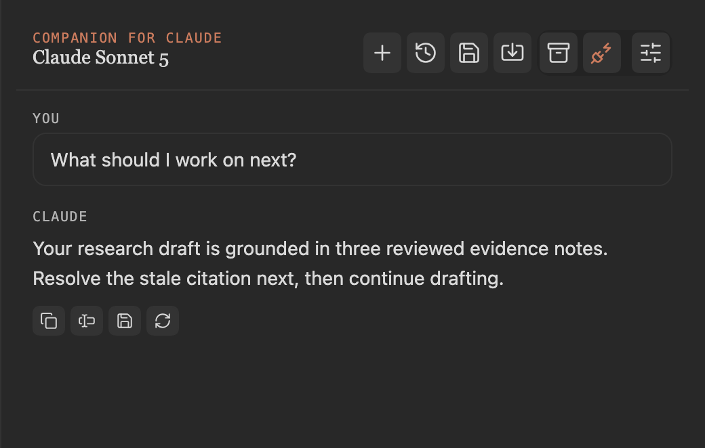

# Companion for Claude

Cowork with Claude inside your [Obsidian](https://obsidian.md) vault. Companion
brings vault-aware chat, reviewable agent work, interactive artifacts, and an
evidence-backed research workflow into Obsidian while your notes remain the
source of truth.

[](https://github.com/cavi-ai/claude-obsidian/actions/workflows/obsidian-plugin-ci.yml)
[](https://obsidian.md/plugins?id=claude-companion)
[](../LICENSE)

[**Install from the Obsidian community store**](https://obsidian.md/plugins?id=claude-companion)
· [Getting started](../guides/getting-started.md)
· [All guides](../README.md#guides)



## Install

1. Open **Settings → Community plugins → Browse**.
2. Search for **Companion for Claude**, then install and enable it.
3. Open Companion and choose a connection:
   - **Claude Code sign-in** on desktop, using the installed `claude` command.
   - **Anthropic API** on desktop or mobile, using your own credential.
   - **Local model** through Ollama or an OpenAI-compatible endpoint.
4. Open a note, enable the **Note** context chip, and send your first message.

[Walk through setup and the first useful workflows →](../guides/getting-started.md)

## What Companion adds to Obsidian

- **Vault-aware chat** with the active note, selection, links, search results,
  folders, PDFs, images, and pasted screenshots as context.
- **Agent mode** that can search, read, and follow links while showing every tool
  call; writes remain behind confirmation.
- **Reviewable edits** with per-hunk acceptance before a note changes.
- **Research Desk and Workbench** for sources, evidence, claims, outlines,
  drafts, and deterministic assurance checks.
- **Interactive `claude-html` artifacts**, native Canvas files, and Obsidian
  Bases generated from your vault.
- **On-device semantic search** on desktop and mobile, including page-located
  PDF chunks.
- **Durable conversations** that survive restarts. An interrupted model turn
  returns as stopped work with a **Retry** action.
- **Optional integrations**: a loopback MCP bridge for live-vault tools, and an
  MCP client for servers you explicitly configure.

The product overview stays in the [repository README](../README.md). Detailed
behavior and setup live in the guides:

- [Agent mode, edits, and guardrails](../guides/agent-mode.md)
- [Research Desk and Workbench](../guides/research-workbench.md)
- [Interactive artifacts](../guides/artifacts.md)
- [Local models and semantic search](../guides/local-models.md)
- [Claude Code and the MCP bridge](../guides/claude-code-bridge.md)
- [Authentication and cost](../guides/auth.md)
- [Architecture](../guides/architecture.md)
- [FAQ](../guides/faq.md)

## Desktop agents

Companion chat can run directly through Claude Code. Choose **Claude Code — your
subscription** under **Connection** and Companion uses one resumable CLI session
per saved conversation. This backend does not require the MCP bridge.

For portable Claude Code workflows using the official Obsidian CLI:

```text
/plugin marketplace add cavi-ai/plugins
/plugin install obsidian-agent@cavi-ai
```

The optional Companion MCP bridge is for Claude Desktop and advanced clients
that need live research, semantic-search, ontology, or controlled-write tools.
It is off by default, binds only to `127.0.0.1`, requires a non-empty bearer
token, and does not advertise mutation tools until **Allow writes** is enabled.

[Set up desktop integrations and review the tool boundary →](../guides/claude-code-bridge.md)

## What leaves your machine

Companion has no telemetry or analytics. Network activity follows an action you
take or a backend you choose.

- **Anthropic or your API base URL:** a direct-API chat, agent, or utility turn
  sends the prompt, attached vault context, and system prompt.
- **The installed `claude` command:** a desktop Claude Code turn sends the
  prompt and attached vault context to the CLI, which owns authentication and
  service traffic.
- **Your Ollama host or OpenAI-compatible endpoint:** selecting that backend
  sends the request to the server you run.
- **Hugging Face and jsDelivr:** the one-time embedding download requests only
  the model and ONNX runtime after you approve it; both are cached.
- **Cloud-session services:** **Send to cloud Claude session** sends the prompt
  and attached note context to your configured routine fire URL. Pulling cloud
  replies sends the repository, branch, and folder you configured to GitHub.
- **Research services:** an explicit discovery or import action sends search
  terms or bibliographic identifiers to OpenAlex, Crossref, arXiv, or Zotero.
- **Web pages and search services:** web capture, `web_fetch`, and `web_search`
  send only the URL or query you supplied.
- **External MCP servers:** a tool call you confirm sends that tool's arguments
  to the server you configured.

Semantic and keyword indexes stay on device. Credentials live in Obsidian's
encrypted secret storage, never the vault-synced `data.json`. Desktop shell
execution uses argument arrays rather than shell strings and covers only the
Claude/Obsidian CLIs, browsers you select for artifacts, and stdio MCP servers
you configure; it is disabled on mobile.

For the complete endpoint, WebAssembly, site-specific capture, and cloud-session
details, see [Authentication and cost](../guides/auth.md),
[Local models](../guides/local-models.md), and the
[architecture guide](../guides/architecture.md).

## Artifact security

Companion renders a fenced ```` ```claude-html ```` block in a sandboxed iframe
with scripts allowed but same-origin access denied. A restrictive content
security policy blocks network requests and form submissions, so the artifact
cannot reach the vault, cookies, or remote services. Saving an artifact writes
the same block to a normal Markdown note.

[Artifact behavior and authoring examples →](../guides/artifacts.md)

## Development and testing

All commands run from this directory:

```bash
pnpm install
pnpm run typecheck
pnpm run lint
pnpm test
pnpm run docs:verify
pnpm run build
```

To install a development build, copy `main.js`, `manifest.json`, and
`styles.css` to `<vault>/.obsidian/plugins/claude-companion/`, then enable
**Companion for Claude** in Community plugins. `pnpm run dev` watches and
rebuilds `main.js` for active development.

See [`CONTRIBUTING.md`](../CONTRIBUTING.md) for the full gate and release
workflow.

## Releases

- **Store listing:** [Companion for Claude](https://obsidian.md/plugins?id=claude-companion)
- **Source:** [`cavi-ai/claude-obsidian`](https://github.com/cavi-ai/claude-obsidian)
- **Release artifacts:** [`cavi-ai/companion-for-claude`](https://github.com/cavi-ai/companion-for-claude)
- **Version lockstep:** `manifest.json`, `versions.json`, `package.json`, and the
  git tag use the same exact version.

## License

MIT — see [`LICENSE`](../LICENSE). Third-party attribution is in
[`NOTICE`](../NOTICE).
